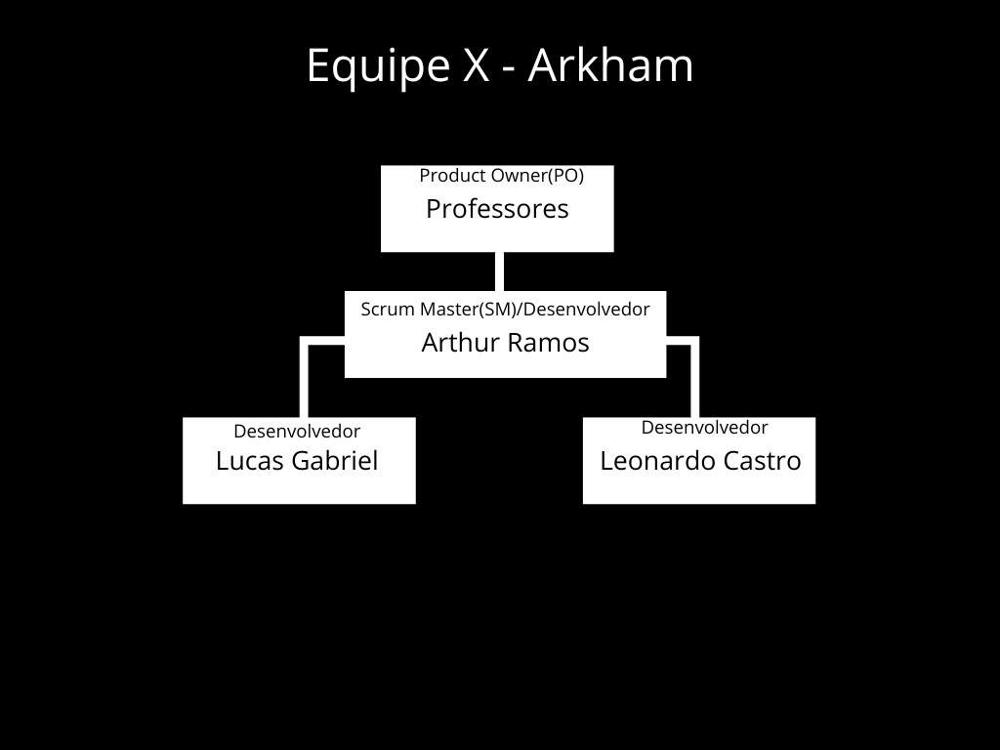
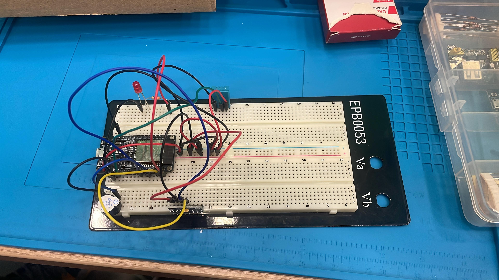

#  Monitoramento de Pacientes e Condições de Risco 

**Componentes**: [Leonardo Castro](https://github.com/thetwelvedev), [Arthur Ramos](https://github.com/ArthurRamos26) e [Lucas Gabriel](https://github.com/lucasrocha777)

## Sumário
<!--
fazer sumário
-->

## Hands-on intermediário

- [x] Sprint 0
- [x] Sprint 1
- [x] Sprint 2
- [x] Sprint 3
- [x] Pitch do projeto


## Organograma


## Projeto Montado


## Documentos

### Big Picture


### Plano de Teste
[Acesse aqui](./docs/Plano_de_testes_arkham.pdf)

### Documento de Definição de Pronto(DoD)
[Acesse aqui](./docs/Definição%20de%20Pronto%20Arkham.pdf)

### Documento de Requesitos Funcionais
[Acesse aqui](./docs/Requisitos_Funcionais_Arkham.pdf)

### Documento de Progresso
[Acesse aqui](./docs/Documento%20de%20progresso_Arkham.pdf)

<!--
### Slide do Pitch
[Acesse aqui](./)


### Esquema de Conexões
[Acesse aqui](./imagens/)
-->

#### Pinagem

| **Componente**                         | **Pino ESP32** | **Descrição**               |
|----------------------------------------|--------------|---------------------------|
| **DHT11 (Sensor de Temperatura e Umidade)** | 15           | Pino de dados do DHT11    |
| **MPU6050 (Acelerômetro e Giroscópio)** | 21 (SCL)     | Clock do I2C              |
| **MPU6050 (Acelerômetro e Giroscópio)** | 22 (SDA)     | Dados do I2C              |
| **LED de Alerta**                       | 23           | Saída para LED de alerta   |
| **Buzzer de Alerta**                    | 18           | Saída para buzzer          |

## Esquema de Ligação

- O **DHT11** precisa de um resistor **pull-up de 10kΩ** entre o pino de dados (15) e o **VCC (3.3V)**.
- O **MPU6050** se comunica via **I2C** utilizando os pinos **SCL (21)** e **SDA (22)**.
- O **LED e o Buzzer** são acionados pelos pinos **23 e 18**, respectivamente.


## Código do Circuito
```C
#include <WiFi.h>
#include <Firebase_ESP_Client.h>
#include <PubSubClient.h>
#include <Wire.h>
#include <MPU6050.h>
#include <DHT.h>

// Definições de sensores e atuadores
#define DHTPIN 15
#define DHTTYPE DHT11
#define LED_PIN 23
#define BUZZER_PIN 18
#define MPU_SCL 21
#define MPU_SDA 22

// Configuração Wi-Fi
#define WIFI_SSID "nome_do_wifi"
#define WIFI_PASSWORD "senha_do_wifi"

// Configuração Firebase
#define API_KEY "api_do_seu_firebase"
#define DATABASE_URL "url_da_api"

FirebaseData fbdo;
FirebaseAuth auth;
FirebaseConfig config;

// Configuração MQTT
#define MQTT_SERVER "broker.hivemq.com"
#define MQTT_PORT 1883
WiFiClient espClient;
PubSubClient client(espClient);

// Inicialização dos sensores
DHT dht(DHTPIN, DHTTYPE);
MPU6050 mpu;

void setup() {
  Serial.begin(115200);

  pinMode(LED_PIN, OUTPUT);
  pinMode(BUZZER_PIN, OUTPUT);

  dht.begin();
  Wire.begin(MPU_SDA, MPU_SCL);
  mpu.initialize();

  if (!mpu.testConnection()) {
    Serial.println("Erro de conexão com o MPU6050");
    while (1);
  }

  conectarWiFi();
  configurarFirebase();
  configurarMQTT();
}

void loop() {
  client.loop();

  float temperature = dht.readTemperature();
  float humidity = dht.readHumidity();
  int16_t ax, ay, az;
  mpu.getAcceleration(&ax, &ay, &az);

  Serial.printf("Temp: %.2fC, Umidade: %.2f%%, AX: %d, AY: %d, AZ: %d\n", temperature, humidity, ax, ay, az);

  bool alerta = false;
  // Verifica se a temperatura, umidade ou variação do movimento lateral (eixos X e Y) ultrapassam os limites
  if (temperature < 20 || temperature > 30 || humidity < 40 || ax < 14000 || ax < 6000 || ax < 7000) {
    acionarAlerta();
    alerta = true;
  }

  enviarFirebase(temperature, humidity, alerta);
  publicarMQTT(temperature, humidity, alerta);
  delay(1000);
}

void conectarWiFi() {
  WiFi.begin(WIFI_SSID, WIFI_PASSWORD);
  Serial.print("Conectando ao WiFi");
  while (WiFi.status() != WL_CONNECTED) {
    delay(1000);
    Serial.print(".");
  }
  Serial.println(" Conectado!");
}

void configurarFirebase() {
  config.api_key = API_KEY;
  config.database_url = DATABASE_URL;
  Firebase.begin(&config, &auth);
  Firebase.reconnectWiFi(true);
}

void configurarMQTT() {
  client.setServer(MQTT_SERVER, MQTT_PORT);
  while (!client.connected()) {
    Serial.print("Conectando ao MQTT...");
    if (client.connect("ESP32Client")) {
      Serial.println("Conectado!");
    } else {
      Serial.print("Falha, rc=");
      Serial.print(client.state());
      Serial.println(" Tentando novamente...");
      delay(2000);
    }
  }
}

void acionarAlerta() {
  digitalWrite(BUZZER_PIN, HIGH);
  digitalWrite(LED_PIN, HIGH);
  delay(2000);
  digitalWrite(BUZZER_PIN, LOW);
  digitalWrite(LED_PIN, LOW);
}

void enviarFirebase(float temp, float umid, bool alerta) {
  Firebase.RTDB.setFloat(&fbdo, "/monitoramento/temperatura", temp);
  Firebase.RTDB.setFloat(&fbdo, "/monitoramento/umidade", umid);
  Firebase.RTDB.setBool(&fbdo, "/monitoramento/alerta", alerta);
}

void publicarMQTT(float temp, float umid, bool alerta) {
  char mensagem[100];
  snprintf(mensagem, sizeof(mensagem), "{\"temperatura\":%.2f, \"umidade\":%.2f, \"alerta\":%d}", temp, umid, alerta);
  client.publish("esp32/monitoramento", mensagem);
}

```
